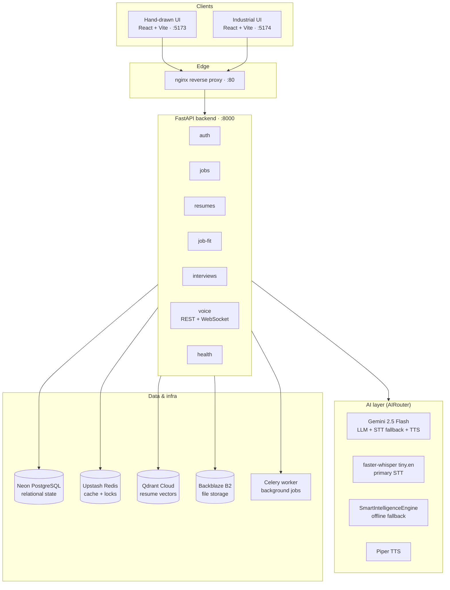
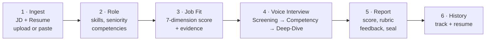
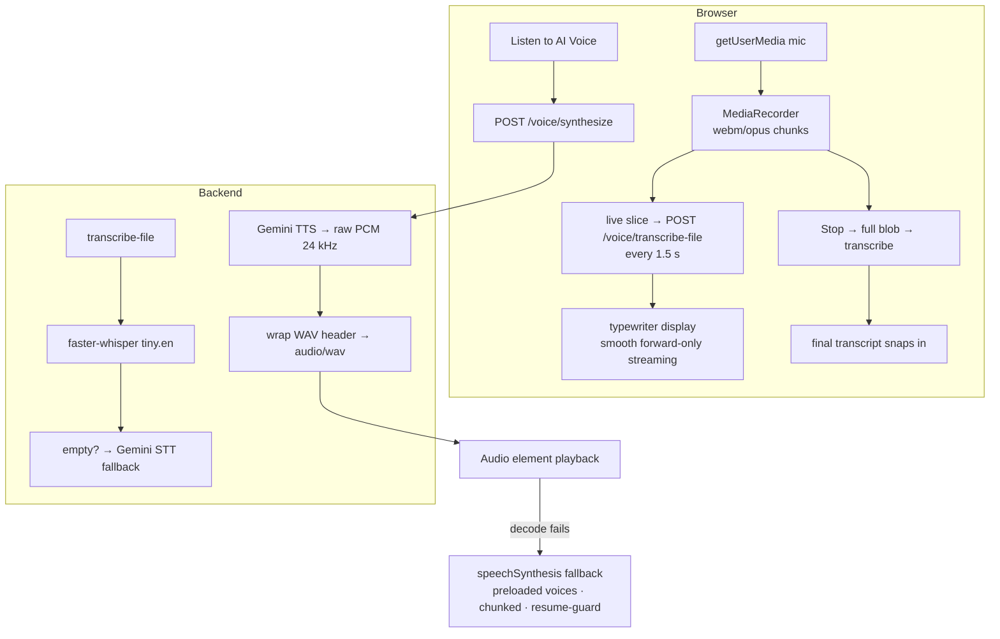
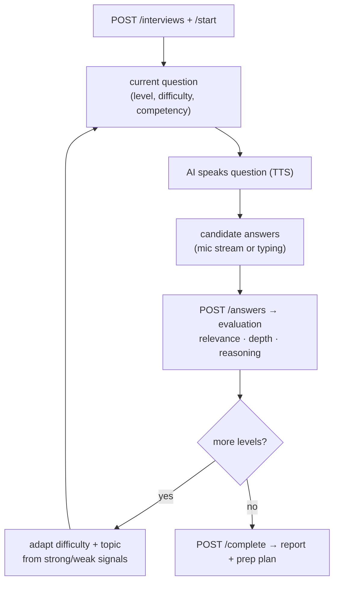
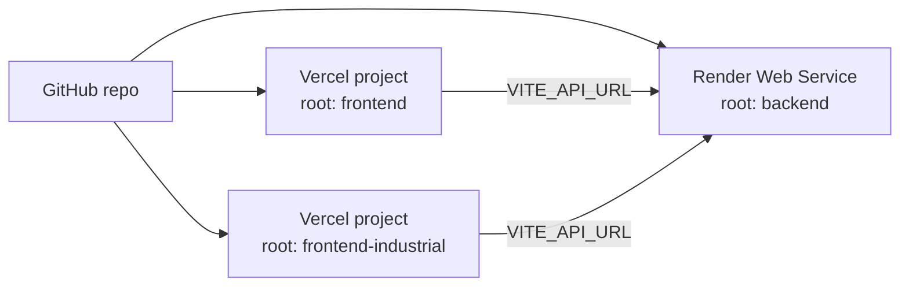

# Checkout — AI Interview Accelerator

**Student Credibility · AI Product Engineer Challenge (Assignment-3)**

An end-to-end, production-grade platform that takes a candidate from **resume + job description** to **interview-ready** — with explainable job-fit scoring, an adaptive AI voice interview simulator, and a calibrated readiness report.


---

## Table of Contents

1. [What Problem Does It Solve?](#1-what-problem-does-it-solve)
2. [Features](#2-features)
3. [System Architecture](#3-system-architecture)
4. [How It Works (Flowcharts)](#4-how-it-works-flowcharts)
5. [Tech Stack](#5-tech-stack)
6. [Monorepo Structure](#6-monorepo-structure)
7. [API Reference](#7-api-reference)
8. [Getting Started](#8-getting-started)
9. [Environment Variables](#9-environment-variables)
10. [The Candidate Journey](#10-the-candidate-journey)
11. [Deployment (Vercel + Render)](#11-deployment-vercel--render)
12. [Testing](#12-testing)
13. [Security & Reliability](#13-security--reliability)
14. [Observability](#14-observability)
15. [Troubleshooting](#15-troubleshooting)
16. [Roadmap](#16-roadmap)

---

## 1. What Problem Does It Solve?

A student holding a **resume** and a **job description** usually cannot answer:

| # | Question | How Checkout Answers It |
|---|----------|------------------------|
| 1 | What is the employer actually looking for? | JD parsing → seniority, required/preferred skills, competencies, responsibilities |
| 2 | How well does my resume match? | Deterministic 7-dimension Job Fit score with JD⇄Resume evidence |
| 3 | What will they ask me? | Adaptive 3-level interview (Screening → Competency → Deep-Dive) |
| 4 | How good are my answers? | Real-time scoring on relevance, depth, reasoning + question-level feedback |
| 5 | What should I study next? | Priority preparation plan (high / medium / low) |
| 6 | Am I actually ready? | Official readiness seal: 🔴 Not Ready · 🟠 Needs Prep · 🟡 Ready · 🟢 Strong Candidate |

---

## 2. Features

### Candidate experience
- **Resume + JD ingest** — paste text or upload PDF/DOCX (parsed, section-chunked, embedded, indexed in Qdrant).
- **Role intelligence** — seniority detection, skill extraction, competency mapping, responsibility breakdown.
- **Explainable Job Fit** — 7-dimension deterministic scoring with matched / partial / missing skills and quoted evidence from both documents.
- **AI voice interview** — real microphone capture (`MediaRecorder`), live partial transcription every 1.5 s, smooth typewriter streaming display, final `faster-whisper` pass on stop.
- **AI interviewer voice** — server-side neural TTS (Gemini, WAV 24 kHz) with robust browser `speechSynthesis` fallback (voice preloading, sentence chunking, Chrome pause-bug guard); click toggles Stop.
- **Webcam or simulated feed** — real `getUserMedia` video or animated canvas simulation, rectangular taped frame.
- **Performance report** — overall 0–100 score, 7-axis competency rubric, strengths/weaknesses, per-question feedback (good / better / ideal direction).
- **Preparation plan** — prioritized topics with reasons and action items.
- **History** — every attempt logged with scores; Good (≥70%) / Needs Work filters, average tracking, resume-any-interview.
- **Two complete themes** — hand-drawn paper UI (`frontend`, :5173) and industrial console UI (`frontend-industrial`, :5174).

### Platform
- **Pluggable AI providers** — `LLMProvider` / `STTProvider` / `TTSProvider` contracts with Gemini, faster-whisper, Piper, Ollama, and a zero-dependency `SmartIntelligenceEngine` fallback.
- **Full-duplex voice WebSocket** — `/api/v1/voice/sessions/{id}/stream` (session handshake, ping/pong, barge-in, transcript events).
- **JWT auth** (access + refresh), async SQLAlchemy 2.x, Redis caching/locks, Celery workers, Backblaze B2 file storage, Qdrant Cloud vectors.
- **Docker Compose** one-command stack: backend, worker, Postgres 16, Redis 7, Qdrant, nginx, Prometheus.

---

## 3. System Architecture



---

## 4. How It Works (Flowcharts)

### 4.1 End-to-end candidate flow



### 4.2 Voice pipeline (the part users feel)



### 4.3 Adaptive interview loop



---

## 5. Tech Stack

| Layer | Technology |
|-------|-----------|
| Frontend(s) | React 19, TypeScript, Vite 8, Tailwind CSS, lucide-react |
| Hand-drawn theme | Kalam + Patrick Hand fonts, wobbly radii, hard offset shadows, canvas `VoiceVisualizer`, `VideoCamera` |
| Industrial theme | Mono console aesthetic, `OscilloscopeWave`, `IndustrialMonitor`, LED indicators |
| Backend | FastAPI, Python 3.13, SQLAlchemy 2.x (async), asyncpg, Pydantic v2 + Settings |
| Auth | JWT access + refresh (PyJWT, argon2/passlib) |
| AI | Google Gemini 2.5 Flash (LLM, STT fallback, TTS), faster-whisper `tiny.en` (STT), Piper (TTS), Ollama adapter, SmartIntelligenceEngine fallback |
| Data | Neon PostgreSQL, Upstash Redis, Qdrant Cloud, Backblaze B2 (S3-compatible, `s3v4` signing, local fallback) |
| Realtime | WebSocket voice sessions, `MediaRecorder` audio upload |
| Background | Celery + Redis |
| Infra | Docker Compose (backend, worker, postgres:16, redis:7, qdrant, nginx, prometheus), Render + Vercel for cloud |
| Tests | pytest, pytest-asyncio, Playwright |

---

## 6. Monorepo Structure

```
checkout/
├── backend/
│   ├── app/
│   │   ├── ai/                  # contracts, router, providers
│   │   │   ├── contracts.py     # LLMProvider / STTProvider / TTSProvider
│   │   │   ├── router.py        # AIRouter (provider selection)
│   │   │   └── providers/       # gemini, faster-whisper ×2, smart_engine,
│   │   │                        # piper, ollama, local embeddings
│   │   ├── api/v1/              # auth, jobs, resumes, job_fit,
│   │   │                        # interviews, voice, health
│   │   ├── application/services/# auth, job, resume, job_fit, interview,
│   │   │                        # report, chunking, document_parser
│   │   ├── core/                # config, database, redis, security, exceptions
│   │   ├── domain/schemas.py    # Pydantic API schemas
│   │   ├── infrastructure/      # SQLAlchemy models, B2 storage, Qdrant client
│   │   ├── observability/       # Prometheus metrics, tracing
│   │   ├── workers/             # Celery app + tasks
│   │   ├── main.py              # FastAPI app, CORS, middleware
│   │   └── seed.py              # demo candidate seed
│   ├── tests/                   # e2e interview, production standards, Playwright
│   ├── Dockerfile
│   └── requirements.txt
├── frontend/                    # hand-drawn UI (:5173)
│   ├── src/
│   │   ├── components/interview/ # VideoCamera, VoiceVisualizer
│   │   ├── components/ui/        # WobblyButton/Card, SpeechBubble,
│   │   │                        # HandDrawnInput, StickyNote, ReadinessBadge
│   │   └── lib/api.ts           # typed API client (VITE_API_URL aware)
│   └── vercel.json
├── frontend-industrial/         # console UI (:5174)
│   ├── src/components/          # IndustrialMonitor, OscilloscopeWave, …
│   └── vercel.json
├── nginx/nginx.conf
├── prometheus/prometheus.yml
└── docker-compose.yml
```

---

## 7. API Reference

Base path: `/api/v1`. Envelopes look like `{ success, data, meta, error }`.

| Method | Endpoint | Purpose |
|--------|----------|---------|
| POST | `/auth/register` · `/auth/login` · `/auth/refresh` | JWT auth lifecycle |
| GET | `/auth/me` | Current user |
| POST | `/jobs` · `/jobs/upload` | Create / upload JD (+ AI analysis) |
| GET | `/jobs/{job_id}` | Fetch analyzed JD |
| POST | `/resumes` · `/resumes/upload` | Create / upload resume (parse → chunk → embed → index) |
| GET | `/resumes/{resume_id}` | Fetch resume + claims |
| POST | `/job-fit` | 7-dimension fit score + evidence |
| POST | `/interviews` | Create interview session |
| POST | `/interviews/{id}/start` | First question |
| GET | `/interviews/{id}/current-question` | Resume / poll question |
| POST | `/interviews/{id}/answers` | Submit transcript → evaluation |
| POST | `/interviews/{id}/complete` | Finish → report + prep plan |
| GET | `/interviews/{id}/report` · `/interviews/{id}/preparation` | Report + study plan |
| GET | `/interviews/history` | Attempt history + summary |
| POST | `/voice/transcribe` · `/voice/transcribe-file` | STT (base64 JSON or audio upload) |
| POST | `/voice/synthesize` | Neural TTS → WAV `audio_base64` |
| WS | `/voice/sessions/{id}/stream` | Full-duplex voice session |
| GET | `/health/live` · `/health/ready` | Liveness + dependency probe |

Interactive docs: `http://localhost:8000/docs` · `http://localhost:8000/redoc`

---

## 8. Getting Started

### Prerequisites
- Python 3.13 + Node 18+
- Docker (for postgres/redis/qdrant) **or** cloud URLs (Neon, Upstash, Qdrant Cloud)
- A Gemini API key ([Google AI Studio](https://aistudio.google.com/))

### Option A — Docker Compose (full stack)
```bash
# 1. Configure
cp backend/.env.example backend/.env   # then fill secrets (see §9)

# 2. Boot everything (backend, worker, postgres, redis, qdrant, nginx, prometheus)
docker compose up --build

# 3. Open
# API → http://localhost:8000/docs   |  Health → http://localhost:8000/api/v1/health/ready
```

### Option B — Local dev (workspace style)
```bash
# Backend (terminal 1)
cd backend
python3 -m venv .venv && source .venv/bin/activate
pip install -r requirements.txt
cp .env.example .env   # fill secrets
uvicorn app.main:app --host 0.0.0.0 --port 8000 --reload

# Hand-drawn UI (terminal 2)
cd frontend && npm install && npm run dev -- --host 0.0.0.0 --port 5173

# Industrial UI (terminal 3)
cd frontend-industrial && npm install && npm run dev -- --host 0.0.0.0 --port 5174
```

> Frontend dev servers proxy nothing — the API base is `VITE_API_URL` (defaults to `http://localhost:8000/api/v1`).

### Demo credentials (seeded)
- Email `candidate@studentcredibility.com` · password `accelerator123`
- The app also auto-logs-in a demo session on load.

---

## 9. Environment Variables

Backend (`backend/.env`):

| Key | Required | Purpose |
|-----|----------|---------|
| `SECRET_KEY` | ✅ | JWT signing (generate a long random string) |
| `DATABASE_URL` | ✅ | `postgresql+asyncpg://…` (Neon or local) |
| `REDIS_URL` | ✅ | `rediss://…` (Upstash) or `redis://localhost:6379/0` |
| `GEMINI_API_KEY` | ✅ | Powers LLM eval, STT fallback, neural TTS |
| `DEFAULT_AI_PROVIDER` | — | `gemini` (default) |
| `QDRANT_URL` / `QDRANT_API_KEY` | ✅ | Resume vector index |
| `B2_ENDPOINT_URL` / `B2_KEY_ID` / `B2_APPLICATION_KEY` / `B2_BUCKET_NAME` | ✅ | Resume file storage (auto-falls-back to local disk) |
| `CORS_ORIGINS` | ✅ | JSON array, e.g. `["http://localhost:5173","https://<app>.vercel.app"]` |
| `ENVIRONMENT` / `DEBUG` | — | `production` / `False` |

Frontend (Vercel or `.env.local`):

| Key | Purpose |
|-----|---------|
| `VITE_API_URL` | Backend base, e.g. `https://<api>.onrender.com/api/v1` (defaults to localhost) |

---

## 10. The Candidate Journey

1. **Ingest** — paste or upload the JD + resume (PDF/DOCX/TXT). Files land in B2 (local fallback), text is section-chunked and embedded into Qdrant.
2. **Role** — review extracted seniority, required/preferred skills, competencies, responsibilities.
3. **Job Fit** — overall score + 7 dimensions with JD⇄Resume evidence, partial matches, and missing-skill gaps.
4. **Voice Interview** — three adaptive levels:
   - *Level 1 · Screening* — motivation & role fit
   - *Level 2 · Competency* — architecture & problem solving
   - *Level 3 · Deep-Dive* — challenges resume claims with counter-questions
   
   Speak via microphone (live typewriter transcription) or type; listen to the AI interviewer; optional camera feed.
5. **Report** — 0–100 score, competency rubric, strengths/weaknesses, per-question coaching, readiness seal, prioritized prep plan.
6. **History** — all 27-style attempts tracked with Good/Needs-Work filters and averages; resume any session.

---

## 11. Deployment (Vercel + Render)

> Backend stays **off** Vercel: `faster-whisper` + WebSockets need a persistent server.



1. **Push**: `git add -A && git commit -m "chore(deploy)" && git push origin main`
2. **Render** (backend): New Web Service → repo, Root `backend`, Build `pip install -r requirements.txt`, Start `uvicorn app.main:app --host 0.0.0.0 --port $PORT`. Add all §9 vars. Free tier sleeps + may OOM on Whisper — **Starter ($7/mo)** recommended. Verify `/docs`.
3. **Vercel** (frontend): New Project → repo, Root `frontend`, Framework Vite, env `VITE_API_URL=https://<render-host>/api/v1`. Repeat for `frontend-industrial` as a second project.
4. **CORS**: add the Vercel URL(s) to Render's `CORS_ORIGINS` (JSON array) → Manual Deploy.
5. Notes: HTTPS everywhere (required for mic/camera); `VITE_*` bakes at build time — redeploy after changing it; first transcription post-deploy is slow (model download).

---

## 12. Testing

```bash
cd backend
PYTHONPATH=. .venv/bin/pytest -v tests/test_e2e_interview.py   # full interview lifecycle
PYTHONPATH=. .venv/bin/pytest -v tests/test_production_standards.py
PYTHONPATH=. .venv/bin/pytest -v                                # entire suite
npx playwright test                                             # browser E2E (test_playwright_e2e.py)
```

---

## 13. Security & Reliability

- **JWT** access (60 min) + refresh (7 d) rotation; argon2 password hashing.
- **Anti-prompt-injection**: document inputs are XML-boundary-tagged as untrusted data.
- **SSRF defense**: outbound URL resolution blocks RFC-1918/metadata IPs.
- **Concurrency**: atomic transactions + optimistic locking on interview state; Redis distributed locks.
- **Resilient storage**: B2 client uses `s3v4` signing, timeouts + retries, and local-disk fallback — uploads never 500 on transient blips.
- **Graceful AI degradation**: Whisper → Gemini STT → heuristic; Gemini TTS → browser speech; every external call is timeout-bounded and logged.

---

## 14. Observability

- **Prometheus** (`:9090`) scrapes app metrics (`app/observability/metrics.py`) with request-ID + latency headers (`X-Request-ID`, `X-Process-Time-Ms`).
- **Tracing hooks** in `app/observability/tracing.py`.
- **Health**: `/api/v1/health/live` (process) and `/api/v1/health/ready` (DB + Redis probes).
- Structured JSON logs throughout (`{"time", "level", "name", "message"}`).

---

## 15. Troubleshooting

| Symptom | Likely cause → fix |
|---------|-------------------|
| `Microphone permission denied` but browser says allowed | Brave/Chromium blocks Google cloud SR (`not-allowed`) — hardware mic is still live; backend Whisper does the transcription. Enable `brave://settings/privacy` → Google speech services if you want browser SR too. |
| Spoken words never appear in the box | Audio too short/quiet (`<500 B` ignored) or Whisper filtered silence — speak ≥2 s, check tab mic icon. |
| `Listen to AI Voice` silent | No OS voices (Linux) + server TTS unreachable — check `GEMINI_API_KEY`, backend `/voice/synthesize`, and the speaker toggle. |
| Resume upload 500 | Transient B2 reset — now auto-falls-back to local storage; retry + check B2 keys. |
| Report shows score with 0 answers | Legacy stored reports — finish ≥1 answer; empty interviews now score 0 / NOT_READY. |
| Render free tier: first request hangs | Cold start (~50 s) + Whisper model download (~1 min once). |
| Vercel UI hits localhost | `VITE_API_URL` unset at build — set it and redeploy. |
| CORS errors in prod | Vercel URL missing from `CORS_ORIGINS` JSON array on Render → update + redeploy backend. |

---

## 16. Roadmap

- [ ] Real-time streaming STT over the voice WebSocket (ring-buffer Whisper) instead of 1.5 s slices
- [ ] Piper offline TTS voice pack for zero-cloud interviews
- [ ] Multi-role tracks + recruiter dashboard
- [ ] Expanded Playwright coverage + load tests (k6) with p95/p99 budgets
- [ ] i18n (hindi/Hinglish interview mode)

---

**Built for Student Credibility · Honours Bhadauria** — FastAPI · React · Gemini · Whisper · Qdrant · Neon · Upstash · Backblaze B2.
